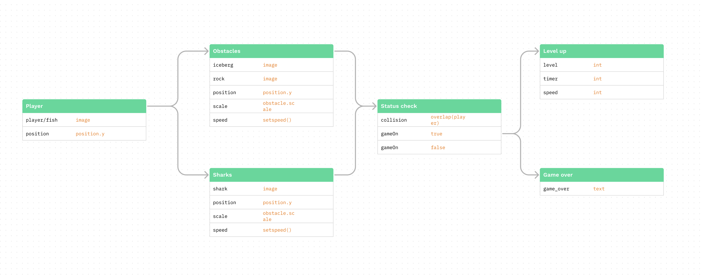

# Complex Interactive System

For this project, I'm creating a simple obstacle avoiding game. 

I found an [example](https://openprocessing.org/sketch/1280352) that is very similar to the game I had in mind. I liked the overall simple game mechanic, but having spikes as obstacles does not make much sense to me so I decided to modify those objects and add icebergs and rocks as they fit the environment/context better. 

I then worked backwards and created this UML diagram in Figma that highlights the key objects and variables in this game. 

In my final version of the game, there are icebergs floating at the top and then there are rocks at the button of the ocean. The positions, sizes and appearance of both types of objects are randomized to add more difficulty to the game.

## Final result

Use up/down arrow to control - 
* https://mxymarcos.github.io/AC-MDes-CP1/OOP/index.html

### Resources used:
* https://openprocessing.org/sketch/1280352
