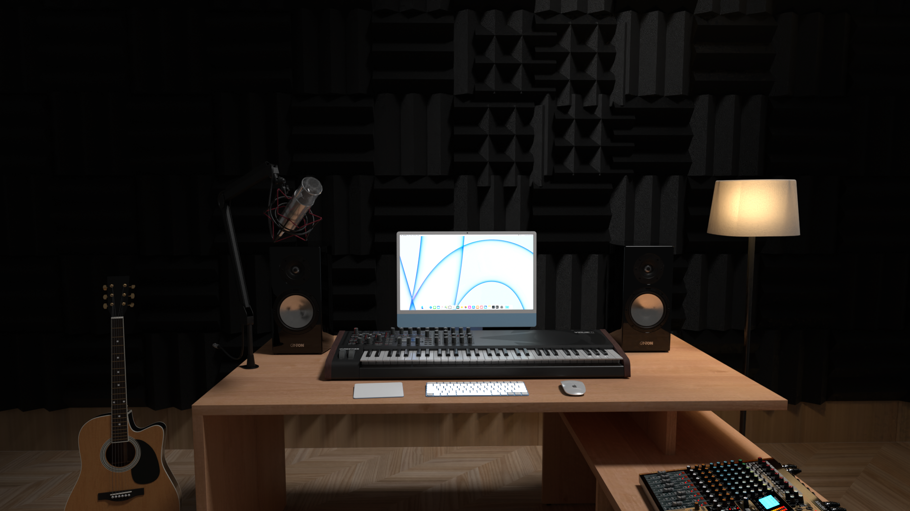

# Building a product interface in Blender

For this project, I'm creating a home studio environment to show case the new web interface I designed for SoundCloud. 

I added equipments and tools commonly found in music studios. My product is targeted towards small music producers, so instead of using models of larger consoles/mixers, I ended up going with more modest equipments. 

I also started building the backdrop - I'm planning on making the back wall covered with acoustic panels in order to make this scene more realistic. Next I'll be focusing on the lighting in the studio. 

When my UI prototype is ready I will plug it in and animate the scene. 

This is what the studio looks like now:

### Update - 11/7

To complete the home studio atmosphere, I have added a floor lamp and an acoustic guitar to the scene. I have then duplicated the acoustic foam model to cover the entire back wall as seen in the image below - 

I have also tweaked the overhead lighting to simulate a ceiling light. I went with the spot light option to add some dramatic effect while drawing more attention towards the center of the scene, which is the computer monitor.

I couldn't figure out how to create a wooden floor so I followed a tutorial, which uses PBR textures to modify the material of an object. After experimenting with different PBR samples and sizes, I got the wooden floor somewhat realistic looking.

I am stilling working on the final prototype of the web dashboard, so that has not been added. I did render a static frame of the scene using the cycles engine, and it look roughly 40 minutes for a single image. For the animated video I think I will probably have to revert back to Eevee.

Here's the rendered image in glorious 1080p - 

#### Resources used:
* Blender Kit
* Free PBR
* https://www.cgbookcase.com/learn/how-to-use-pbr-textures-in-blender/