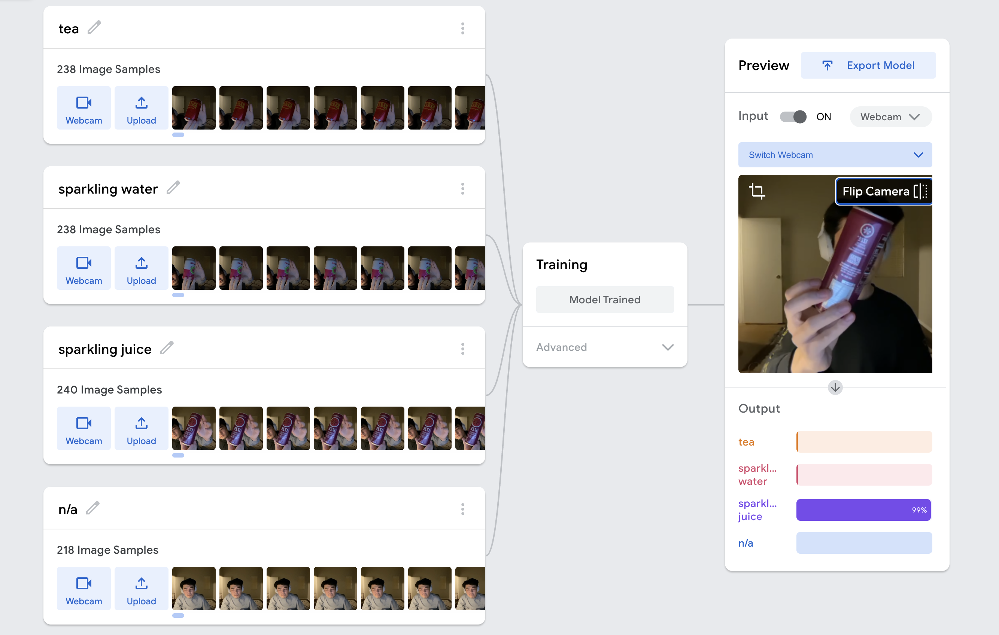

# Refine your interface

I started with training the model with some packaged foods around my apartment. I decided to limit the function of this program to packaged food as it'd be more difficult to determine the amount of food with the tools we have. 

In addition to the features I shared in class, I added a switch camera function to the program. The program is using front facing cameras at default, so that the program would work on different platforms including laptops. There is an additional button for camera switching as shown in the the screenshots below. 

It's interesting that the program sometimes has a difficult time differentiating the sparkling juice from the sweet tea. I think that's because they are very similar in color, and I had only trained the model under dim lighting condition. I imagine it'd perform better if I bring these drinks to different environments to train the model.

## P5.js code

* https://editor.p5js.org/mxymarcos/sketches/uFCie_aSY

