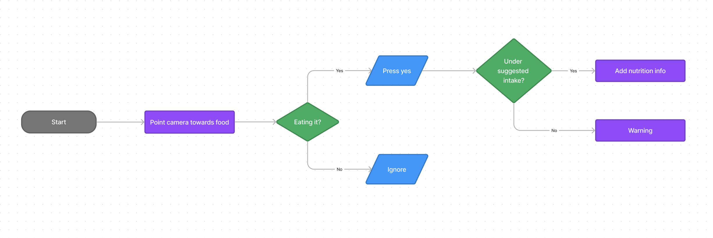
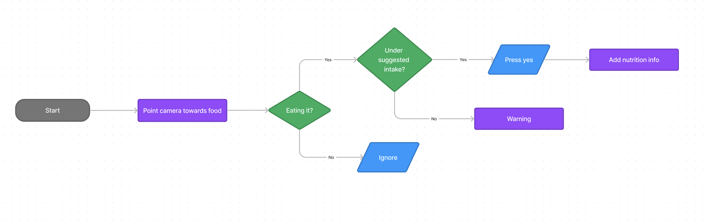

# Find your interface

For my final project, I'm recreating a specific feature that's built into a new AI powered gadget - AI pin. 

In a previous class we watched a [video](https://www.youtube.com/watch?v=th3vzKTE0O8) of an overview on a new product that uses generative AI. Though I'm still quite skeptical about the overall concept of this new device, as the makers claim it's going to be a smart phone replacement, I still found certain features of this device interesting. One of which is having the ability to figure out the nutritious information about the food you hold in front of you.

I wanted to replicate this feature using Teachable Machines and p5.js. Before I started to train models and write the program, I quickly came up with a user flow to demonstrate the process of recording nutritious intake. 

I ended up moving the suggested daily nutrition intake check before pressing the button as that'd b the more natural interaction with the program.

