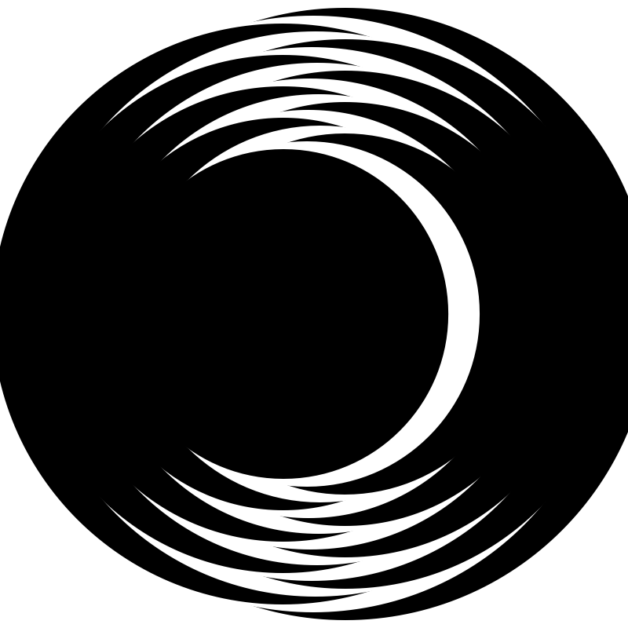
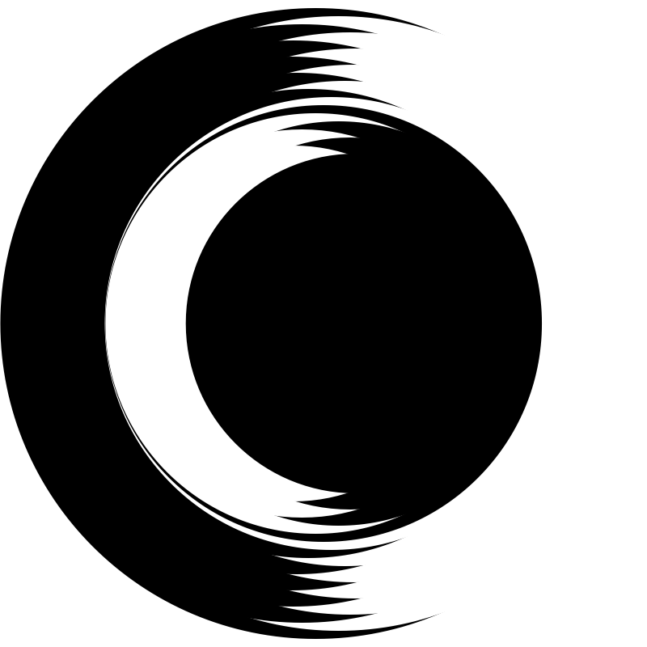
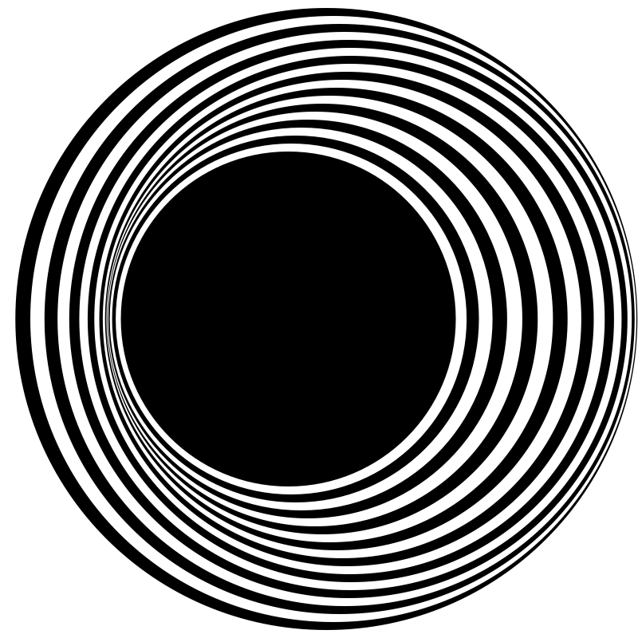
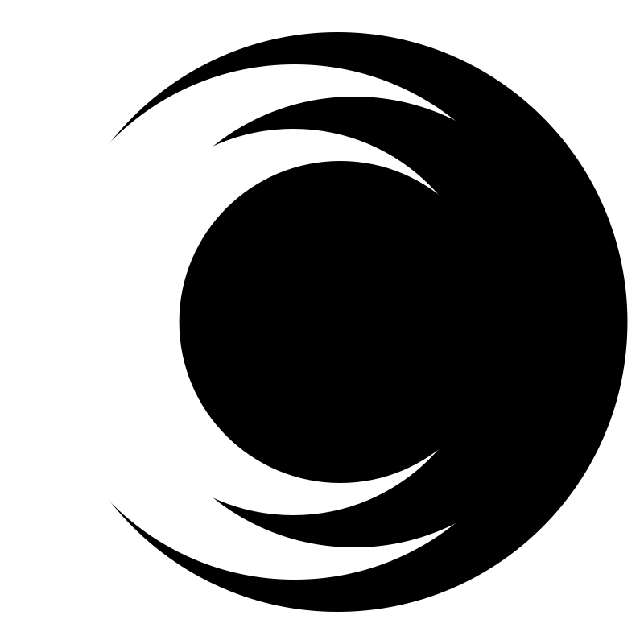
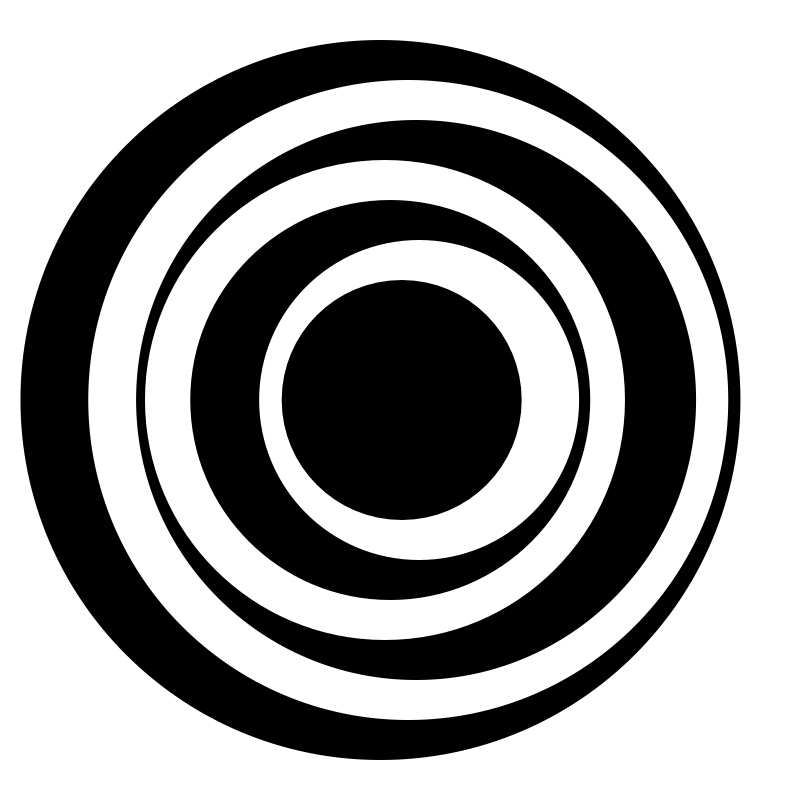

# Time & oscillation

## Screenshots
\
An early iteration of the oscillating circles.

\
A very interesting pattern I was able to capture.

\
Started fine tuning the amount & sizes of the circles.

\
Interesting pattern but maybe I need to add more circles. I also started fine tuning movement speed, etc.

\
At this point I was pretty happy with the pattern & the movement.

\
Added changing background colors.

### Link to sketch:
* https://mxymarcos.github.io/AC-MDes-CP1/week10/assignment/index.html
