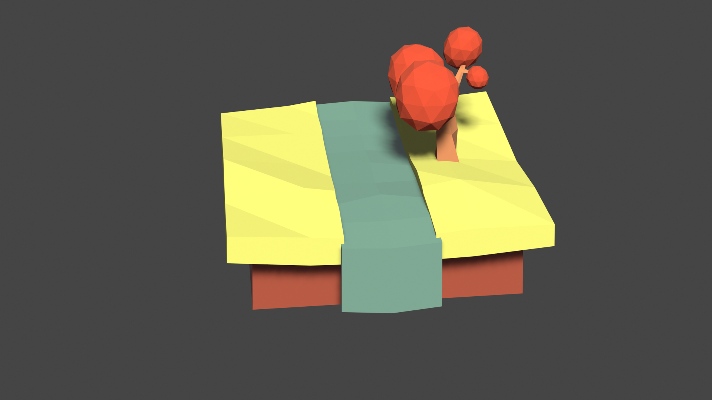
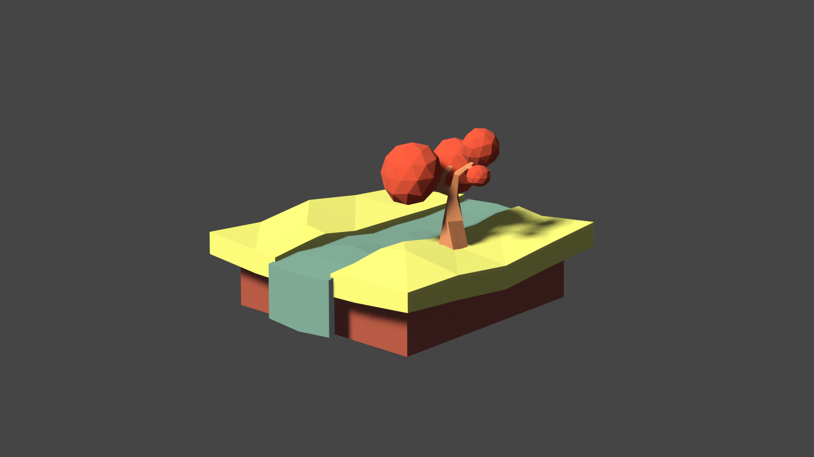
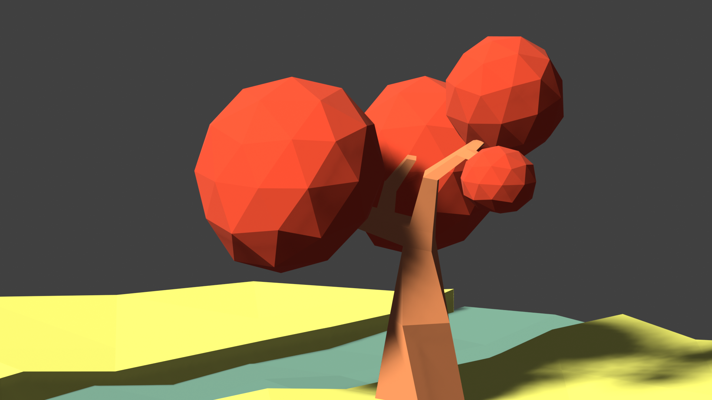
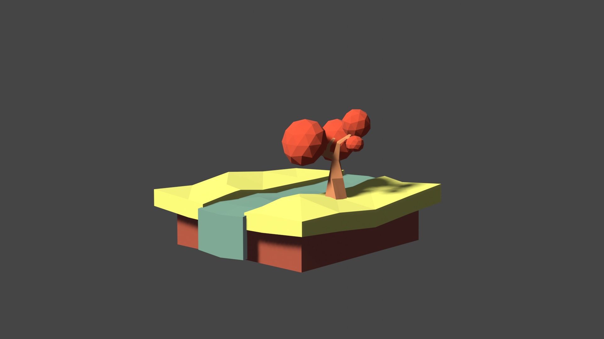

# Week 5 assignment

When it comes to learning new things and working with unfamiliar concepts, I personally prefer to follow guides and work on tangible examples. For example, I learned to use Sketch by copying a skeuomorphic button example I found on [medium.com](http://medium.com); I learned to play guitar and bass by learning actual songs as soon as I picked up those instruments. I found that I can usually get the hang of techniques as well as theories through practice.  

For this project, I wanted to create a low poly island that I used to come by a lot on dribbble.com. Since I’m new to Blender, I followed a video tutorial I found on [YouTube](https://www.youtube.com/watch?v=ELiqWceCk0Q).

Unfortunately, a lot of Blender videos labeled with “beginner tutorial” are not beginner friendly at all. That is the case here with the video I tried to follow. The video *was* helpful, but the artists sometimes failed to explain how to go about certain things - they used a lot of shortcuts without further explaining how or where to find the tools needed. I ended up spending a lot of time trying to figure out the missing steps. 

However, the video was still helpful and it has helped me learn new concepts, shortcuts, as well as features such as modifiers. I was planning on adding more elements including rocks and a bench in the scene but I ran out of time. 

Here are a few renders of the scene I created - 

The first one is rendered with Cycles engine. The rest are with Eevee.

